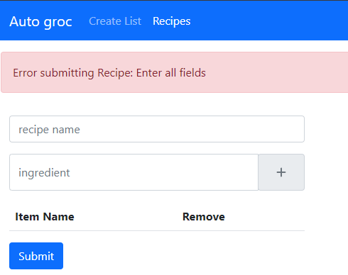
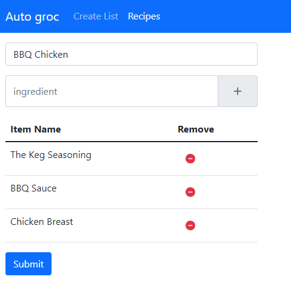
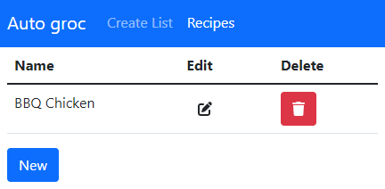
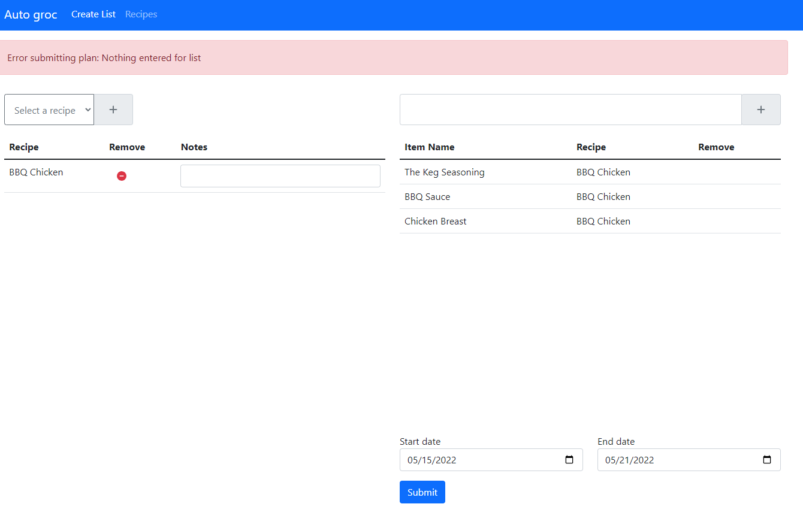
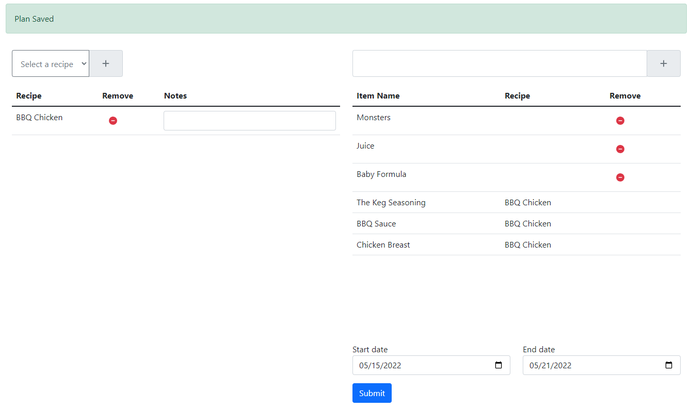
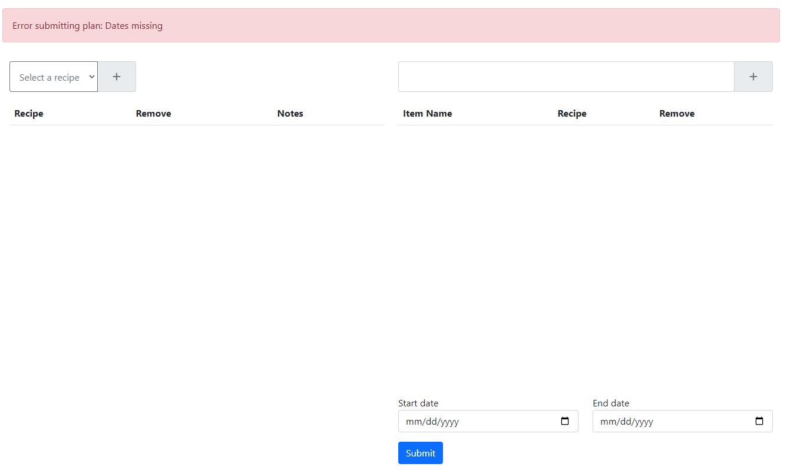
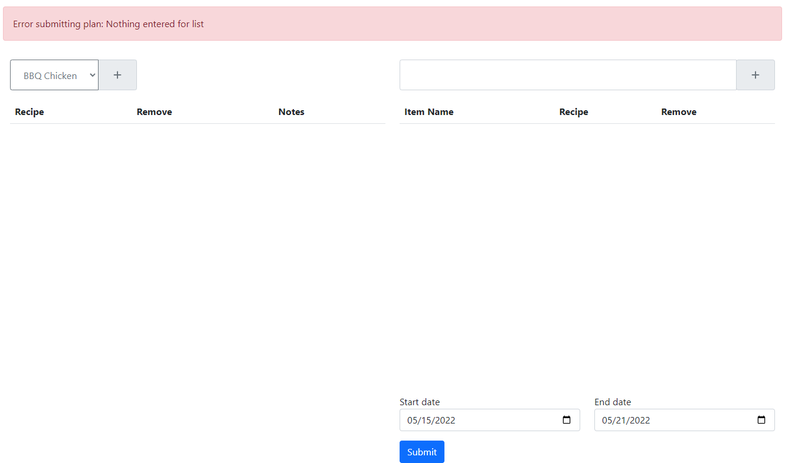
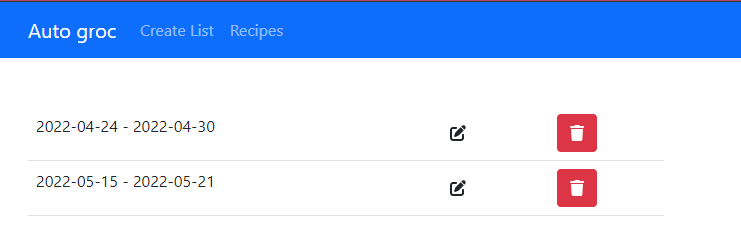
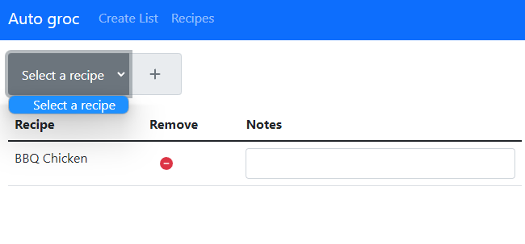

# Auto Groc

App created using REACT frontend, NODE backend, and MONGO for database. Bootstrap and fontawesome were used for the frontend as well. I focused more on the functionality than the design for this app. I did not move to proper GIT branching and versioning until near the end of development, as I learned more about GIT during this project. See my next project for full development using proper branching.

## Feature List at release

-   Add, Edit, Remove recipes.
    -   Add, Remove ingredients
-   Add, Edit, Remove meal plans/grocery lists.
    -   Add, Remove recipes
    -   Add, Edit, Remove ingredients
-   Mark plans/lists as complete
    -   Mark specific ingredients, whole recipes, and the entire list
-   Set an auto archive process for plans/lists to be removed, regardless of completion.

## How to run

-   This app was created using create-react-app, and it was developed using Docker. It should be fairly straight forward to run, `docker-compose up --build` should run everything you need.

## Screenshots and some of the above features

-   Add, Edit, Remove recipes

Adding a recipe

 

Edit and Delete buttons for Recipes.

Create a Grocery List.

Some of the list errors

List of plans on homepage, edit and delete from here

Once a recipe is added to the list you cannot add it again. This is a decision I am still unsure about.

